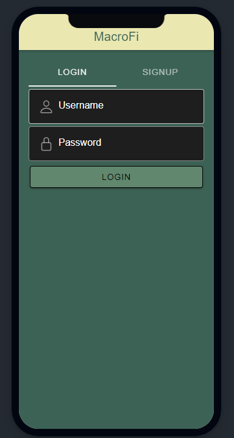
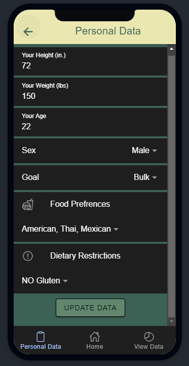
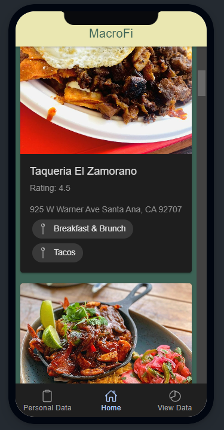
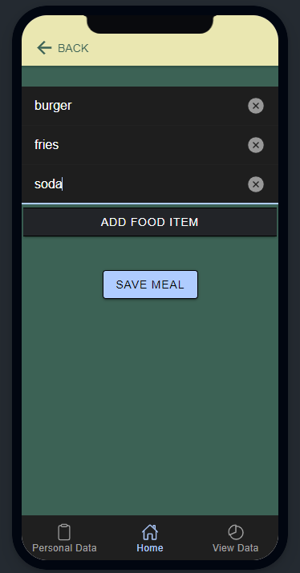
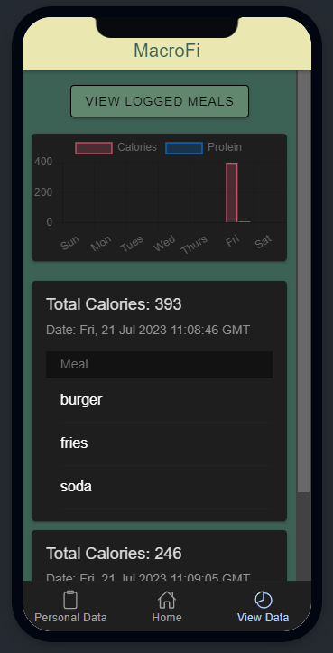

# MacroFiApp

    
    
    
    
    

## Motivation

Good health is a big factor in the well-being of UCI students, and one of the biggest contributors of good health is a healthy, balanced, and cost-effective diet. A majority of students attending UCI stay on or near campus and eat at the dining halls or at the nearby UTC with its large number of restaurants. What any student needs is information to make informed decisions about what goes into their bodies. There is currently way too much information about all the food in restaurants or in the dining halls online to properly parse through for students, and it can get overwhelming for someone who just wants to make a simple, healthy choice everyday about what to eat. At the same time, there isn’t enough information about the makeup of food in terms of calories, macronutrients, or micronutrients that add up to a person’s daily, balanced intake. Students should be able to make informed decisions every day on what to eat, where to eat it, how healthy it is in terms of calories or nutrients, and its price.
